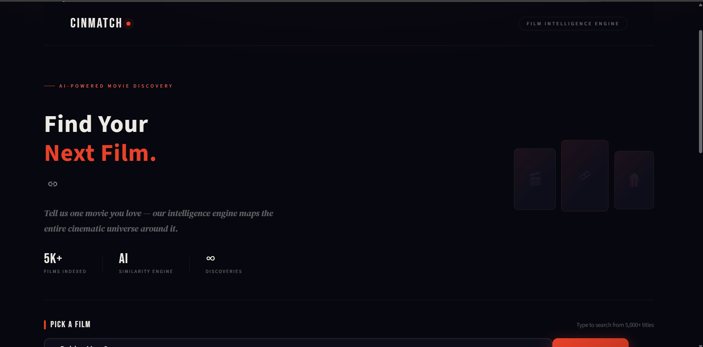
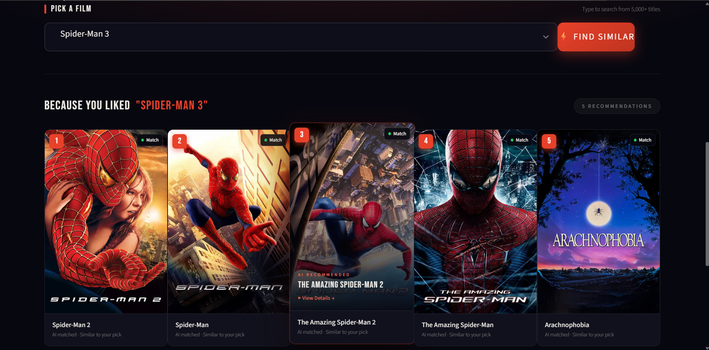
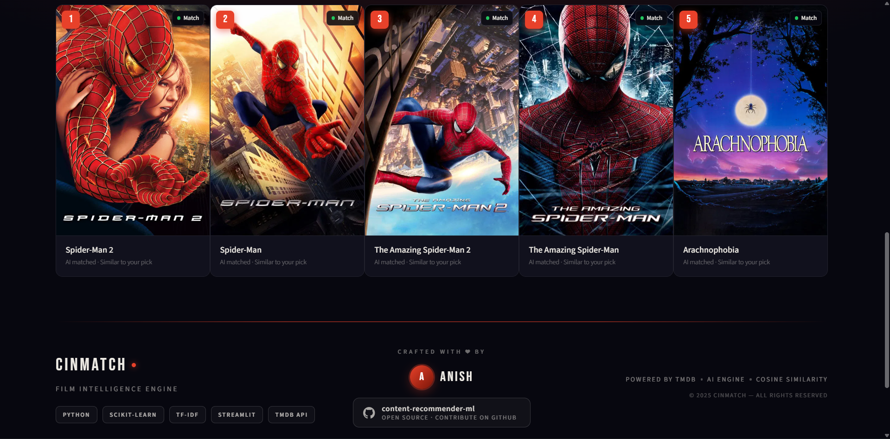

<div align="center">
  <h1>🎬 CINMATCH — Film Intelligence Engine</h1>
  <p><strong>A production-ready, AI-powered content-based movie recommendation engine featuring a stunning custom UI.</strong></p>
  
  <p>
    
    
    
    
  </p>
</div>

<br/>

<div align="center">
  
</div>

## 🌌 Overview

**CINMATCH** goes beyond standard recommendation scripts to offer a fully immersive movie discovery platform. It combines an advanced machine learning backend with a visually breathtaking, highly customized frontend designed in PyCharm and rendered via Streamlit.

By analyzing the semantic DNA of a film—its genres, cast, crew, keywords, and plot summary—CINMATCH maps the cinematic universe around your favorite movies to deliver uncanny, high-fidelity recommendations in milliseconds.

## ✨ Key Features

- **🧠 NLP-Powered Matching** — Uses advanced TF-IDF vectorization to extract meaningful signals from unstructured movie metadata.
- **📐 High-Dimensional Cosine Similarity** — Mathematically calculates the distance between films in a 5,000+ dimensional feature space for hyper-accurate matching.
- **⚡ Sub-second Inference** — Pre-computed similarity matrices allow for near-instant, real-time results without loading screens.
- **🎨 Premium Custom UI** — Features a completely bespoke CSS architecture built on top of Streamlit. Includes glassmorphism, ambient glows, responsive poster grids, and fluid micro-animations.
- **🌍 Dynamic API Integration** — Seamlessly hooks into the TMDB API to fetch live, high-resolution movie posters and metadata on the fly.
- **🏗️ Modular Architecture** — Clean separation of concerns between data pipeline, ML training, artifact serialization (`.pkl`), and presentation layer (`app.py`).

<br/>

<div align="center">
  
</div>

## 🛠️ Technology Stack

| Domain | Tools & Technologies |
|--------|----------------------|
| **Frontend UI** | Streamlit, Custom CSS3 (Glassmorphism, Grid/Flexbox), TMDB API |
| **Machine Learning** | `scikit-learn` (TF-IDF Vectorizer, Cosine Similarity), `pandas`, `numpy` |
| **NLP & Preprocessing**| `NLTK` (PorterStemmer), JSON parsing |
| **Data Storage** | `pickle` (Serialized ML Artifacts) |

## 🏗️ How the Intelligence Engine Works

```text
Raw Data (TMDB 5000 Movies & Credits)
        │
        ▼
Data Preprocessing (Merging, Null Handling, JSON parsing)
        │
        ▼
Feature Engineering (Combining: genres + cast + director + keywords + overview -> "Tags")
        │
        ▼
NLP Vectorization (TF-IDF applied to "Tags" -> Sparse Matrix)
        │
        ▼
Similarity Compute (Cosine Similarity -> 5000x5000 Pre-computed Matrix)
        │
        ▼
Model Artifacts (Exported as similarity.pkl & movies.pkl)
        │
        ▼
Web Application (Loads artifacts -> Takes User Input -> Renders Matches + TMDB Posters)
```

<br/>

<div align="center">
  
</div>

## ⚙️ Local Installation & Setup

Want to run the engine locally? Follow these steps:

**1. Clone the repository**
```bash
git clone https://github.com/anish-devgit/content-recommender-ml.git
cd content-recommender-ml
```

**2. Create and activate a virtual environment**
```bash
# macOS / Linux
python -m venv venv
source venv/bin/activate

# Windows
python -m venv venv
venv\Scripts\activate
```

**3. Install dependencies**
```bash
pip install -r requirements.txt
```

**4. Ensure ML Artifacts are present**
Make sure `movies.pkl` and `similarity.pkl` are in the root directory. If they are missing, run the Jupyter Notebook (`movie-recommendation-system.ipynb`) to generate them.

**5. Launch the application**
```bash
streamlit run app.py
```
*The app will launch in your browser at `http://localhost:8501`.*

## 🔮 Future Roadmap
- [ ] **Hybrid Recommendation System:** Blend content-based scores with collaborative filtering.
- [ ] **Transformer-based Embeddings:** Replace TF-IDF with `Sentence-BERT` models for deeper semantic contextual understanding.
- [ ] **REST API Module:** Build an exposed `/recommend?title=` endpoint using FastAPI for third-party integrations.
- [ ] **Containerization:** Complete Docker support for easier cloud orchestration.

## 🤝 Contributing
Contributions are always welcome! Feel free to open an issue or submit a Pull Request.
1. Fork the Project
2. Create your Feature Branch (`git checkout -b feature/AmazingFeature`)
3. Commit your Changes (`git commit -m 'Add some AmazingFeature'`)
4. Push to the Branch (`git push origin feature/AmazingFeature`)
5. Open a Pull Request

## 📄 License
This project is open-source and available under the terms of the **MIT License**.

---
<p align="center">
  <i>Designed and engineered with ❤️ by <a href="https://github.com/anish-devgit">anish-devgit</a>. Developed in PyCharm.</i><br/>
  <b>If you like this project, consider giving it a ⭐!</b>
</p>